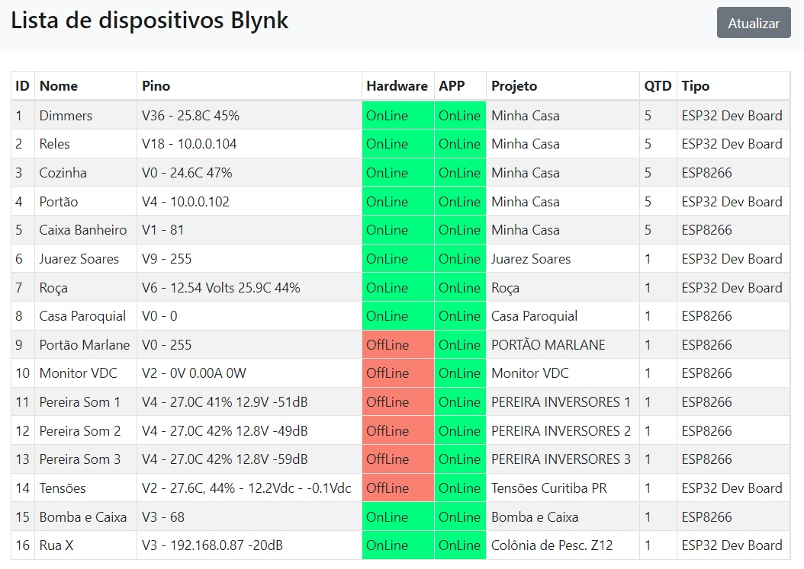

# ListarIotBlynk
Faça uma listagem de todos os seus dispositivos blynk em um só lugar e monitore todos juntos.

Basta editar o arquivo teste.json e colocar todos os seus dispositivos da mesma maneira como os exemplos lá cadastrados:
- [X] Nome (Igual ao cadastrado no APP)
- [X] Pino (Físico ou Virtual que deseja monitorar)
- [X] Token (token do seu dispositivo IOT para ser consultado na API)  

__Exemplo:__



```
{
  "1": {
    "id": 1,
    "nome": "Dimmers",
    "pino": "V36",
    "token": "kgWb3_seuTokenAqui_g6utfdG35"
  },
  "2": {
    "id": 2,
    "nome": "Reles",
    "pino": "V18",
    "token": "WN5BC1a_seuTokenAqui_tuCXv7_"
  },
  "3": {
    "id": 3,
    "nome": "Cozinha",
    "pino": "V0",
    "token": "9c8z_seuTokenAqui_0ophfllYL"
  }
}
```

- [X] Não há limites de dispotivos.
- [X] A página é recarregada a cada 15 segundos ou pode ser recarregada no botão __Atualizar__.
